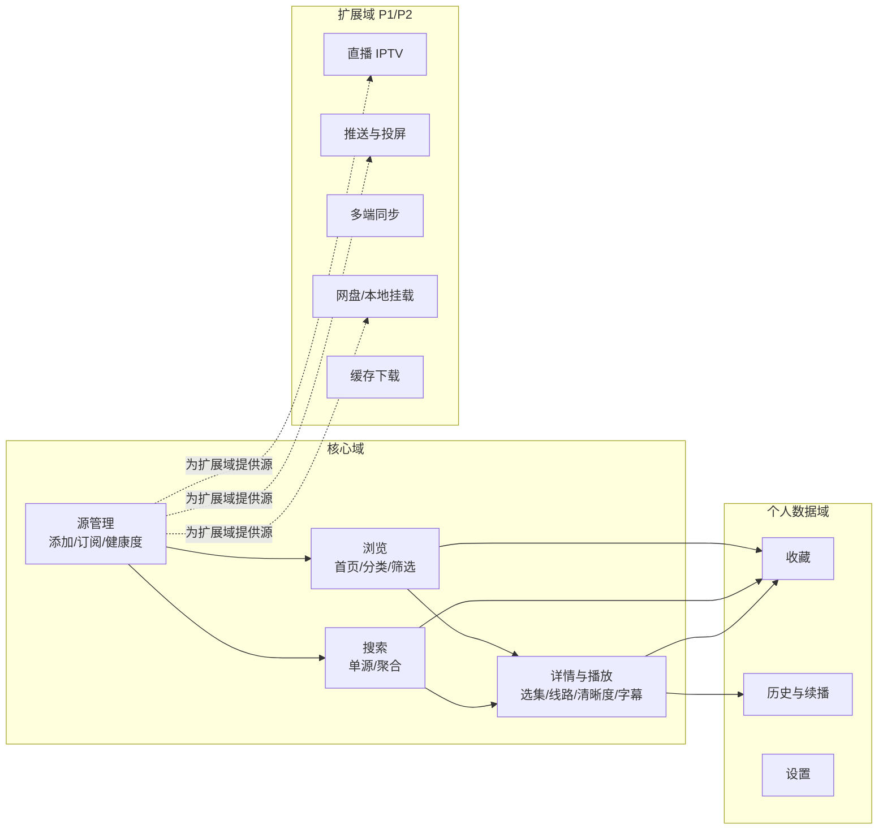

# 星映（StarScreen）· 阶段二：功能规划

> 前置文档：[01-调研总结](./01-调研总结.md)（P1–P10 设计原则均来自该文档第 6 节）
> 下一阶段文档：[03-整体设计方案](./03-整体设计方案.md)

---

## 1. 产品定位

- **产品名**：星映（StarScreen）
- **一句话定位**：一个开源、内容中立的多源影视聚合播放框架，**一套代码跑三端**（Windows 桌面 / 安卓手机 / Android TV），界面风格统一、操作各按其分。
- **产品形态**："聚合播放器壳"——星映本身不提供、不推荐、不内置任何影视内容源；用户自行接入自有合法内容源（自建媒体服务器 API、正版站点接口、网盘挂载等），星映负责聚合、浏览、搜索、播放与个人数据管理。

**合规基线**（对应调研文档 P1/P6 原则）：
1. 首次启动为"空库"状态，进入**添加源引导页**（声明用户须接入自有合法源）；
2. 不内置任何站点、爬虫、解析接口与嗅探盗链能力；
3. 自定义源插件以 JS 沙箱运行，权限受限；
4. 数据全部本地化，无账号、无上传。

**不做什么（Non-Goals）**：不做内容分发平台、不做账号体系与会员、不做源内容审核之外的社区功能。

## 2. 目标用户与使用场景

| 端 | 用户画像 | 典型场景 |
|---|---|---|
| Android TV / 盒子 | 客厅家庭用户，遥控器操作，3 米距离 | 晚间观影、追剧续播、看电视直播、老人小孩大字模式 |
| 安卓手机 | 通勤/碎片时间，单手触屏 | 搜索找片、多源比价式换源、下载离线、投屏到电视 |
| Windows 桌面 | 键鼠用户、大屏多任务 | 键盘快捷键操控、小窗挂机播放、局域网给 TV 推片 |

## 3. 功能架构总图

## 4. 功能清单（P0 = MVP 必做 / P1 = 第二梯队 / P2 = 远期）

### 4.1 源管理

| 功能 | 级别 | 说明 |
|---|---|---|
| 添加源：URL / 粘贴文本 / 本地文件 / 扫码 | P0 | 四通道对应三端：TV 以扫码+推送为主，桌面/手机全支持 |
| 标准 CMS JSON API 直连适配 | P0 | 无插件即可聚合（调研 P3：零门槛上手的核心） |
| 源启用/禁用、排序、分组 | P0 | 支持整组开关，聚合搜索只扫启用源 |
| 源健康度检测与自动优选 | P1 | 后台探活（延迟/成功率），失败源自动降权，列表置灰 |
| TVBox 配置导入器（sites/lives） | P1 | 兼容存量生态，降低迁移成本（调研 P9） |
| JS 插件源（沙箱） | P1 | 面向高级用户的自定义爬虫源，受限执行 |
| 多仓/订阅配置（一个地址管理多个配置） | P1 | 借鉴影视仓"仓库"概念 |
| Alist / WebDAV / 本地目录挂载 | P2 | 可视TV 验证过的差异化能力 |
| 源编辑器/调试面板 | P2 | 开发者向：查看某源原始响应、单独测试 |

### 4.2 浏览与搜索

| 功能 | 级别 | 说明 |
|---|---|---|
| 首页推荐流 | P0 | 按启用源聚合推荐 + "继续观看"入口（历史续播置顶） |
| 分类浏览（分类树 + 多条件筛选 + 分页） | P0 | 筛选条件由源声明（类型/地区/年份/字母） |
| 单源搜索 | P0 | 指定源内搜索 |
| 聚合搜索 | P0 | 并发搜多源、渐进加载、按源分组、同片归并去重；单源失败不影响整体 |
| 搜索历史与联想 | P1 | 本地保存、可清空 |
| 筛选/分类记忆 | P1 | 记住上次分类位置（TV 端尤其重要，配合焦点记忆） |
| 榜单/专题页 | P2 | 依赖源数据质量，后置 |

### 4.3 详情与播放

| 功能 | 级别 | 说明 |
|---|---|---|
| 详情页（元信息、线路列表、选集） | P0 | 多线路归一展示（调研 P8：统一元数据视图） |
| 播放器抽象（三内核） | P0 | Android/TV：ExoPlayer 默认 + IJK 备选；Windows：libmpv(media_kit)；统一接口 |
| 清晰度切换 | P0（v0.1 占位，v0.2 落地） | 由源返回多档流时展示；记录用户偏好。v0.1 适配器尚未填充清晰度轨（docs/13 B3），暂无链路 |
| 线路切换 / 换源 | P0 | 播放中随时切；记住同片上次线路 |
| 倍速（0.5–4.0） | P0 | TV 长按 OK 临时 3x（借鉴惯例） |
| 断点续播 + 跳过片头片尾（手动标记） | P0 | 秒级进度记忆，详情页显示"看到第 N 集 xx:xx" |
| 播放失败自动恢复 | P0 | 重试→自动回退软硬解/内核→提示换线路（调研 P4） |
| 字幕：内封轨道选择 | P0 | 容器内多字幕轨切换 |
| 字幕：外挂加载（本地 srt/ass、同目录自动匹配） | P1 | 样式可调（大小/颜色/延迟） |
| 音轨切换 | P1 | 多音轨内容 |
| 在线字幕搜索/下载 | P2 | OpenSubtitles 类接口，用户自配 |
| 小窗/画中画 | P1 | 桌面 + 手机 |
| 投屏（DLNA） | P1 | 手机/桌面 → 电视 |
| 局域网推送（星映设备互推） | P1 | 手机当遥控配置器（借鉴 9978 模式但加密） |
| 缓存下载 | P1 | 单集/选集批量，断点续传（P2 做下载管理与本地库） |
| 弹幕 | P2 | 依赖源/第三方弹幕库 |

### 4.4 收藏与历史

| 功能 | 级别 | 说明 |
|---|---|---|
| 收藏/取消收藏（含追剧夹分组） | P0 | 海报快照入库，源失效仍可见 |
| 观看历史（时间/进度/总时长） | P0 | 自动去重合并同片记录 |
| 续播 | P0 | 与历史一体；详情页/首页双入口 |
| 批量删除/清空、导出导入 | P1 | 数据可迁移（调研 P5） |
| 收藏夹管理（重命名/排序/删除） | P1 | |
| 局域网多端同步（收藏/历史/配置） | P1 | mDNS 发现 + 端到端互传，无云服务器 |

### 4.5 直播（P1，TV 端为主）

| 功能 | 级别 | 说明 |
|---|---|---|
| m3u / txt 直播源导入 | P1 | 与点播源同一管理入口 |
| 频道分组浏览 + 频道收藏 | P1 | |
| 数字键直接换台 | P1 | TV 惯例（调研 4.4） |
| EPG 节目单 / 时移回看 | P2 | 依赖源提供 EPG |

### 4.6 设置与其他

| 功能 | 级别 | 说明 |
|---|---|---|
| 播放器内核选择、软硬解、默认倍速/清晰度偏好 | P0 | |
| 外观：暗色/亮色主题、布局密度 | P0 | 默认暗色影视风 |
| 缓存管理（图片/数据清理） | P0 | |
| 启动默认页（首页/直播/继续观看） | P1 | TV 惯例 |
| 遥控器键位自定义（TV）/ 快捷键查看（桌面） | P1 | |
| 检查更新 | P1 | 三端安装包自更新或引导 |
| 老人大字模式 / 少儿模式 | P2 | TV 端字号与首页简化 |

## 5. 三端功能矩阵

| 功能 | Windows 桌面 | 安卓手机 | Android TV |
|---|---|---|---|
| 多源聚合/分类/搜索/详情/播放/收藏/历史 | ✅ | ✅ | ✅ |
| 源扫码添加 | ✅（摄像头可用时）/ 二维码互相扫 | ✅ | ✅（常用：手机扫屏上二维码反向填码） |
| 播放页手势（亮度/音量/进度） | — | ✅ | —（五向键/菜单键） |
| 播放页键盘快捷键 | ✅ | — | —（遥控键位） |
| 直播 + 数字键换台 | ✅（数字键同） | ✅ | ✅（核心场景） |
| 小窗/画中画 | ✅ | ✅ | — |
| 投屏发送端（DLNA） | ✅ | ✅ | — |
| 局域网推送 发送端 / 接收端 | ✅ / ✅ | ✅ / ✅ | — / ✅（TV 常驻接收） |
| 缓存下载 | ✅ | ✅ | 可选（盒子存储小，默认隐藏） |
| 多端同步 | ✅ | ✅ | ✅ |
| Alist/WebDAV 挂载 | ✅ | ✅ | ✅（P2） |

## 6. 三端操作习惯适配（对应调研 P7）

| 输入形态 | 导航 | 播放控制 | 关键约定 |
|---|---|---|---|
| TV 遥控器 | 五向键全界面可达；左栏/顶栏 ⇄ 内容区；焦点记忆；OK 确认 | OK 显隐控制条；←/→ 快退快进；长按 OK 3x；菜单键呼出面板（线路/清晰度/字幕/倍速/跳片头）；数字键直播换台 | 焦点永不丢失；放大 1.08+光晕；48dp 安全区 |
| 手机触屏 | 底部 Tab（首页/分类/搜索/我的）；顶部分类 chip 横滑 | 左滑亮度/右滑音量/横滑进度；单击控制栏；双击暂停；长按 2x；边缘返回 | 单手可达；海报卡双列大图 |
| 桌面键鼠 | 左侧窄栏；鼠标 hover 预览态 + 单击 | 空格暂停；←/→ 10s（Shift 30s）；↑/↓ 音量；F 全屏；Esc 返回；0–9 跳转百分比；N/P 上下集 | 快捷键面板可查；窗口缩放自适应列数 |

## 7. 非功能需求

| 类别 | 指标 |
|---|---|
| 性能 | TV 端冷启动 ≤ 2.5s（中端盒子）；海报列表滚动 60fps；聚合搜索并发 ≥ 8 源、单源超时 8s；内存 TV 端峰值 ≤ 300MB |
| 稳定性 | 单源异常（超时/脏数据/崩溃）不影响其他源与主流程；播放链路失败自动降级（内核→硬解→软解→换线路） |
| 兼容 | Android 6.0+（含 Android TV 6.0+，覆盖主流盒子）；Windows 10 1709+ x64 |
| 安全 | JS 插件沙箱（禁文件/禁原生/限网络/限时长）；HTTPS 证书校验；遥测为零 |
| 合规 | 空库启动 + 引导声明；无内置源/解析/嗅探；开源许可证合规（注意 libmpv/IJK 的 GPL/LGPL 义务） |
| 可维护 | 领域层与 UI 解耦（见设计文档）；核心流程有单测；三端共用代码占比 ≥ 80% |

## 8. 版本路线图

| 版本 | 主题 | 范围（对应第 4 节编号） | 验收标准 |
|---|---|---|---|
| **v0.1** | 单源内核跑通 | 4.1 添加源(URL/文件)+CMS 直连；4.2 分类/单源搜索；4.3 详情/播放(Exo+mpv)/倍速/续播；4.4 收藏历史基础；三端壳骨架 + 统一主题 | 用 1 个自有 CMS 源在三端完成"浏览→搜索→播放→续播"闭环 |
| **v0.3** | 多源聚合 | 4.1 源管理完善；4.2 聚合搜索；4.3 线路切换/换源/清晰度；健康度检测 | ≥8 源聚合搜索无卡顿；单源失效不影响整体 |
| **v0.6** | TV 体验 + 字幕 + 直播 | TV 焦点引擎打磨（记忆/永不丢失）；字幕外挂；直播 m3u + 数字键；TVBox 配置导入；JS 插件沙箱 | 纯遥控器完成全部核心动线；导入一份 TVBox 配置可用 |
| **v0.9** | 多端互联 | 局域网推送/投屏/同步；小窗；缓存下载；设置中心完善 | 手机推片到 TV 播放并同步进度 |
| **v1.0** | 三端发布 | 性能优化、崩溃治理、安装包/签名/自动更新、文档与示例源 | 三端安装包发布；核心指标达第 7 节要求 |

> v1.0 后再评估：网盘挂载、弹幕、老人/少儿模式、在线字幕库、源调试面板。
