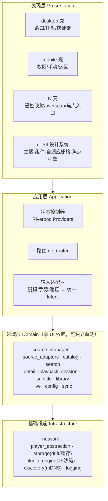
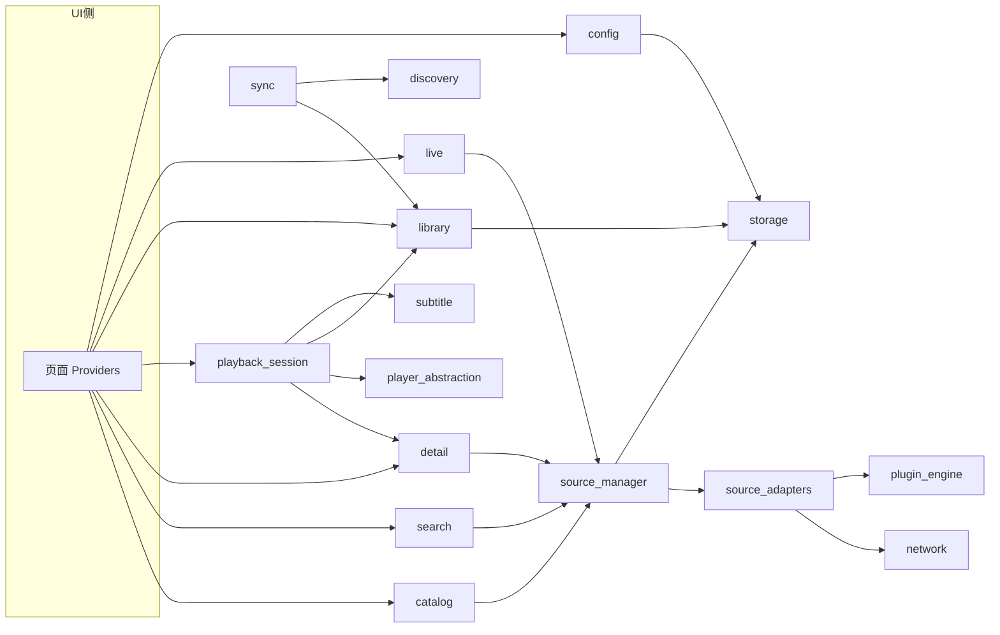
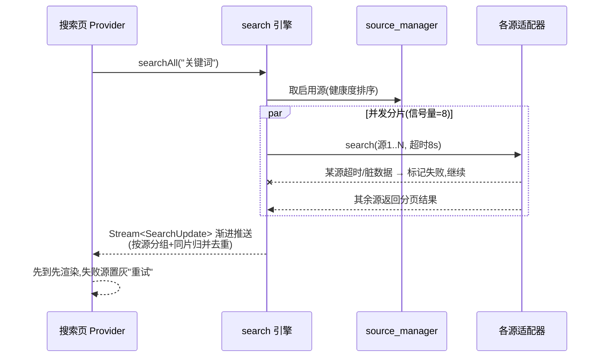
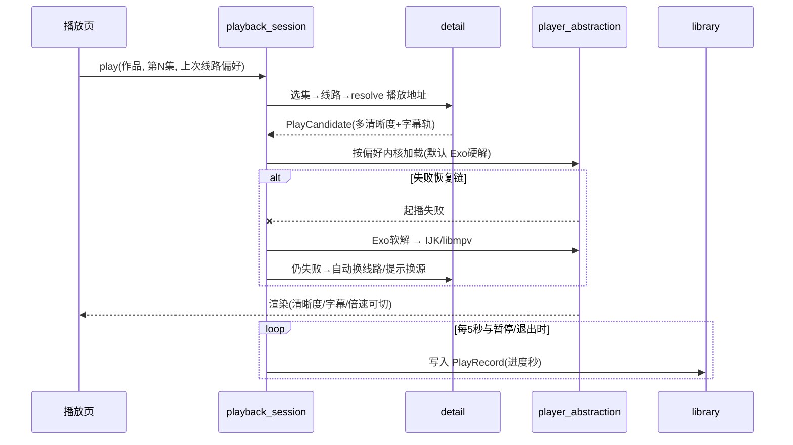
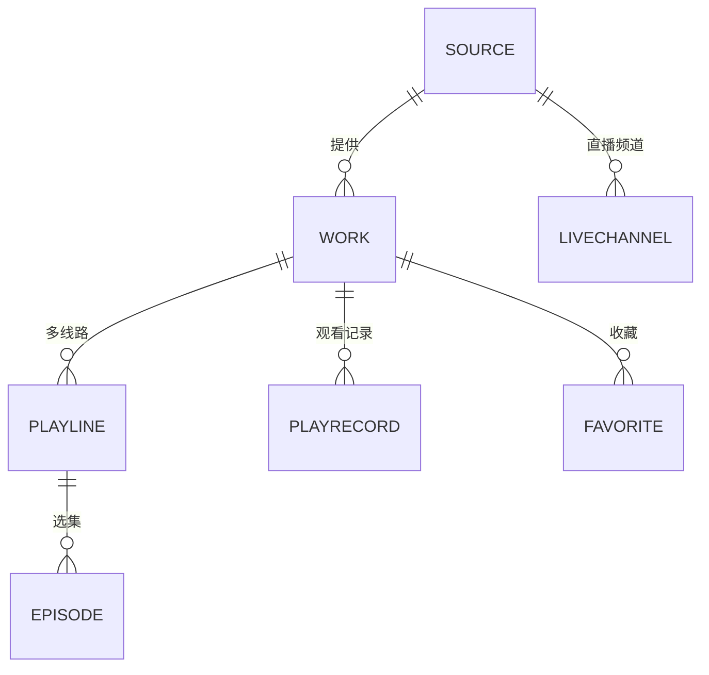

# 星映（StarScreen）· 阶段三：整体设计方案

> 前置文档：[01-调研总结](./01-调研总结.md)（设计原则 P1–P10）、[02-功能规划](./02-功能规划.md)（P0/P1/P2 功能清单）
> 本文档回答四个问题：**用什么技术**、**架构与模块怎么分**、**模块之间什么关系**、**三端 UI 如何统一又各自适配**。

---

## 1. 技术选型

### 1.1 跨端 UI 框架

| 候选方案 | 三端覆盖 | UI 一致性 | TV 焦点生态 | Windows 桌面成熟度 | 播放器生态 | 结论 |
|---|---|---|---|---|---|---|
| **Flutter（主选）** | Windows + Android + Android TV 一套代码 | 自绘引擎，三端像素级一致 | FocusNode 可完全自定义焦点引擎 | 3.x 后稳定（win32 窗口/高DPI/托盘） | media_kit(libmpv)、media3 桥接均可用 | **采用** |
| Kotlin Multiplatform + Compose Multiplatform | Android/TV 原生强，桌面走 JVM | 较一致 | Compose TV 库成熟 | 桌面版仍在演进，分发体积大 | ExoPlayer 原生、桌面播放器弱 | 备选（团队 Kotlin 强时） |
| Electron/Neutralino + 网页 | 桌面好，TV 弱 | 网页一致 | 遥控器焦点是重灾区 | 成熟 | 播放依赖 Chromium/HLS.js，格式受限 | 不采用（TV 端硬伤） |
| 原生双栈（WPF + Android） | 好 | 两套 UI 两套逻辑，维护翻倍 | 各自成熟 | 成熟 | 各自成熟 | 不采用（成本最高） |

**结论**：Flutter。理由：三端 UI 统一是本项目的硬需求（调研 P7），Flutter 自绘带来的"一次设计三端像素一致"是决定性优势；领域层纯 Dart 包与 UI 无关，为将来扩展其他端留有余地。

### 1.2 播放器（对应功能规划 4.3"播放器抽象"）

| 平台 | 默认内核 | 备选内核 | 说明 |
|---|---|---|---|
| Android / TV | **media3 ExoPlayer** | **IJKPlayer(FFmpeg)** | Exo：HLS/DASH、轨道切换、硬解好；IJK：怪流/老编码兼容兜底 |
| Windows | **media_kit（libmpv）** | —（libmpv 本身格式全覆盖） | 支持硬解、外挂字幕、音轨、全协议 |

统一抽象为 `PlayerController` 接口（播放/暂停/seek/轨道选择/倍速/事件流），上层 `playback_session` 不感知内核。**失败自动回退链**：Exo 硬解 → Exo 软解 → IJK/libmpv → 提示换线路（调研 P4）。

### 1.3 关键依赖

| 领域 | 选型 | 备注 |
|---|---|---|
| 状态管理 | Riverpod | 可测试、编译期安全；TV 端焦点状态独立管理 |
| 路由 | go_router | 三端统一路由表，TV 有独立路由分支 |
| 网络 | Dio | 源请求池统一超时/重试/限流（8s 超时，并发信号量） |
| 存储 | drift（SQLite）+ flutter_cache_manager | 收藏/历史/源/设置全本地；海报磁盘缓存 |
| JS 插件 | flutter_js（QuickJS） | 沙箱执行自定义源插件 |
| 设备发现 | mDNS（bonsoir/nsd_platform） | 局域网推送与同步 |
| 序列化 | freezed + json_serializable | 源模型清洗归一（调研 P8） |

### 1.4 许可证注意

ExoPlayer/media3 为 Apache-2.0；libmpv 按 LGPL 编译可规避 GPL 传染（须遵守其条款）；IJKPlayer 为 GPL 系，**以动态加载/独立进程或用户侧安装方式集成**，避免主程序义务。发布前做一次许可证清单审查。

---

## 2. 总体架构：四层单向依赖



**依赖规则**（架构守护红线）：
1. 只允许上层依赖下层，禁止反向；领域层不得 import 任何 Flutter UI 库（CI 加 import-lint 检查）。
2. 领域层通过接口（`PlayerController`、`KeyValueStore`、`HttpClientFactory`）使用基础设施，由 Riverpod 在启动时注入实现——保证领域逻辑可脱离平台单测。
3. 三端壳只做**平台差异**（窗口/权限/输入/生命周期），页面与业务全在共享包——实现"界面风格统一 + 操作各按其分"。

## 3. 模块划分与职责

### 3.1 领域层模块（核心）

| 模块 | 职责 | 对外主要能力 | 依赖 |
|---|---|---|---|
| `source_manager` 源管理 | 源注册/启停/排序/分组、健康度探测与降权、并发调度信号量、配置订阅刷新 | `enabledSources`、`probe(source)`、`withSource()` | source_adapters、storage |
| `source_adapters` 源适配器 | 把异构源归一为统一 `VideoSource` 接口；**元数据清洗归一** | cms_json 适配器、tvbox 导入器、js 插件适配器 | network、plugin_engine |
| `catalog` 分类浏览 | 分类树、筛选条件、分页加载、筛选位置记忆 | `loadCategory()` | source_manager |
| `search` 聚合搜索 | 并发分片搜多源、渐进结果流、同片归并去重、失败源跳过 | `searchAll(kw): Stream<SearchUpdate>` | source_manager |
| `detail` 详情/换源 | 详情聚合、多线路归一、跨源同片匹配（标题+年份指纹） | `getDetail()`、`findAltSources()` | source_manager |
| `playback_session` 播放会话 | 一次播放的全生命周期：选集→线路→清晰度→内核→**失败恢复链**→进度记录 | `play()`、`switchLine()`、`switchQuality()` | detail、player_abstraction、library、subtitle |
| `subtitle` 字幕 | 内封轨枚举切换、外挂 srt/ass 加载（本地/同目录/网络）、样式与延迟 | `tracks()`、`loadExternal()` | player_abstraction、storage |
| `library` 个人数据 | 收藏（夹）、历史、断点续播、导出导入 | `favorites`、`records`、续播查询 | storage |
| `live` 直播 | m3u/txt 解析、频道分组、数字键换台状态机 | `channels`、`tune(n)` | network、storage |
| `config` 设置 | 播放偏好、主题、启动页、缓存策略；KV 存储 | `appConfig` 流 | storage |
| `sync`（P1） | mDNS 发现星映设备、收藏/历史/配置互传（端到端加密） | `syncTo(device)` | discovery、library |

### 3.2 应用层 / 表现层 / 基础设施层模块

| 层 | 模块 | 职责 |
|---|---|---|
| 应用层 | `providers`（页面状态） | 首页/分类/搜索/详情/播放/我的 各页面控制器，组装领域层输出为 UI 状态 |
| 应用层 | `router` | 统一路由表；TV 端返回栈策略（返回键逐级回退 + 首页二次退出） |
| 应用层 | `input_intent` | 三端输入归一：平台事件 → `Intent`（如 `Intent.openDetail(card)`、`Intent.seek(+10s)`），UI 只处理 Intent |
| 表现层 | `ui_kit` | 设计 token（色彩/字体/间距/圆角）、海报卡/列表/筛选条/播放面板、**自适应栅格**（同一组件按屏幕宽度与输入形态变体）、**TV 焦点引擎** |
| 表现层 | `apps/desktop` | Win32 窗口、托盘、文件关联/拖拽播放、自动更新 |
| 表现层 | `apps/mobile` | 权限（存储/网络）、系统返回手势、画中画、投屏发送 UI |
| 表现层 | `apps/tv` | Leanback 启动配置、overscan 安全区包装、遥控键位映射表、数字键换台通道 |
| 基础设施 | `network` | Dio 池：每源独立超时/UA、全局并发上限、失败统计（喂给健康度） |
| 基础设施 | `player_abstraction` | `PlayerController` 接口 + exo/ijk/mpv 三实现与工厂、回退链执行 |
| 基础设施 | `storage` | drift 数据库（第 6 节模型）、迁移、图片缓存、导出导入 |
| 基础设施 | `plugin_engine` | QuickJS 沙箱：注入受限 fetch、禁文件/原生、单插件 CPU 与内存限额、超时杀 |
| 基础设施 | `discovery` | mDNS 广播/发现、局域网推送 HTTP 端口（鉴权 token）、同步传输 |

## 4. 模块关系与关键数据流

### 4.1 依赖关系图（领域层为主视角）



要点：`source_manager + source_adapters` 是全系统的"水源"，`playback_session` 是播放链路的"总指挥"，`library` 是个人数据唯一写入口（播放进度由 playback_session 回调写入，其他模块只读）。

### 4.2 时序：聚合搜索（调研痛点"单源失败拖垮整体"的解法）



### 4.3 时序：起播与失败恢复（对应功能规划 4.3"播放失败自动恢复"）



## 5. 源接入设计（核心契约）

### 5.1 统一源接口契约（设计示意，非实现代码）

```text
VideoSource（所有源适配器的统一抽象）
  meta:        名称/分组/能力声明（可搜索? 可筛选? 支持的清晰度?）
  home()            → 首页推荐流
  category(query)   → 分类+筛选+分页 的作品卡片
  search(kw, page)  → 搜索结果分页
  detail(workId)    → 元信息 + 多线路 + 每线路选集
  resolve(request)  → 单集播放地址 + 清晰度轨 + 字幕/音轨描述
```

上游（catalog/search/detail/playback）**只见此契约**，不知道源的真实形态。`WorkCard` 等模型经过适配器"清洗归一"（标题去噪、海报兜底、年份/备注规范化），保证异构源渲染一致（调研 P8）。

### 5.2 三种接入方式（对应功能规划 4.1）

| 方式 | 级别 | 机制 | 安全性 |
|---|---|---|---|
| **CMS JSON 直连适配器** | P0 | 原生实现常见标准影视 API（列表/详情/搜索端点），零插件 | 高：纯 HTTP JSON |
| **TVBox 配置导入器** | P1 | 解析配置 JSON：`sites`(type 0/1→CMS 适配器；JS 类→JS 插件；jar 类→标记"暂不支持")；`lives`→直播源；`parses`/嗅探规则**不导入**（合规基线） | 中：导入白名单能力 |
| **JS 插件沙箱** | P1 | QuickJS 执行自定义插件：仅注入受限 fetch（走统一请求池）、禁文件/原生/定时器滥用、CPU/内存/时长限额、异常即熔断 | 高：能力最小化 |

### 5.3 源健康度与调度

后台每 N 分钟对启用源做轻量探活（首页或热门端点），记录延迟/成功率 → 健康分。效果：聚合搜索按健康分排序并发；列表页失效源置灰；播放失败自动按健康分推荐备选源。

## 6. 数据模型与存储



| 表 | 关键字段 | 说明 |
|---|---|---|
| `source` | id, name, type(cms_json/js/tvbox_import), url, groupId, enabled, sort, health(latency/successRate/lastCheck) | 源注册表 |
| `work_snapshot` | workKey(sourceId+workId 复合), title, poster(缓存路径), year, remarks, genre, score, raw | 作品快照：**收藏/历史存快照**，源失效后"我的"仍完整 |
| `play_record` | workKey, episodeIndex, lineId, positionSec, durationSec, updatedAt | 断点续播唯一事实源 |
| `favorite` | workKey, folderId, createdAt | 收藏 |
| `favorite_folder` | id, name, sort | 追剧夹 |
| `live_channel` | sourceId, group, name, url, logo, epgId, tuneNo | 直播频道（tuneNo 支持数字键） |
| `app_setting` | key, value(JSON) | 配置 KV |

存储策略：单 SQLite（drift）随应用数据目录；海报走磁盘缓存（LRU，TV 端上限可调）；播放进度**5 秒节流写库**并在暂停/退出/切集时强制落盘；全部数据可导出为加密 JSON 包（导出/导入/同步共用一个格式）。

## 7. UI 设计方案：一套设计语言，三套输入

### 7.1 设计语言（星映 Design Tokens）

| Token | 值 | 说明 |
|---|---|---|
| 背景 / 卡片 | `#0B0E14` / `#161C28` | 暗色影视风为默认，亮色主题可选 |
| 主色 / 强调 | `#4A7DFF`（星蓝）/ `#FF7A45`（暖橙，续播/进度） | 品牌渐变用于启动页与焦点光晕 |
| 文字层级 | `#E8ECF4` / `#9AA3B2` / `#5C6470` | 标题/正文/辅助 |
| 海报卡 | 2:3，圆角 12，标题在卡下 | 全端统一卡片规格 |
| 栅格 | 手机 2–3 列 → 桌面 4–8 列 → TV 6–7 列 | 随宽度与 DPI 自适应 |
| 间距 | 4px 基线（4/8/12/16/24/32） | |
| 焦点态（TV） | 放大 1.08 + 主色描边光晕 + 按下态收缩 0.97 | 动画 ≤ 150ms，不越安全区 |

### 7.2 三端信息架构（同一页面集，不同导航壳）

```text
页面集（共享）: 启动引导 / 首页 / 分类 / 搜索(聚合) / 详情 / 播放 / 直播 / 收藏夹 / 历史 / 设置 / 源管理

手机壳: 底部 Tab[首页·分类·搜索·我的] + 顶部分类 chip 横滑 + 边缘返回手势
TV 壳:  左侧竖栏[首页·点播·直播·收藏·历史·设置] + 右侧内容区(行式海报墙)
        焦点在侧栏⇄内容区间水平/垂直移动; 全屏播放独占
桌面壳: 左侧窄栏(图标+文字,可折叠) + 内容区 + 全局搜索框(Ctrl+K) + 小窗/多任务
```

### 7.3 TV 焦点引擎（本项目的技术重点）

- **全局方向仲裁**：统一处理五向键，基于几何最近邻 + 行列锚定，杜绝"焦点跳飞"；异常路径用显式焦点序修正。
- **焦点记忆**：每页记录"最后焦点路径"，返回/切 Tab 恢复（分类页筛选位置 + 卡片位置双记忆，对应功能规划 4.2）。
- **锚区滚动**：列表滚动时焦点保持在视觉中部锚区，到边缘才带滚；惯性滚动期间不丢焦点。
- **可达性红线**：CI 检查所有可交互组件必须可聚焦；任何弹层打开/关闭必须声明焦点去向（ Trap 检测）。
- **安全区**：TV 壳全局套 48dp（约 5%）overscan 边距；正文最小 16sp。

### 7.4 播放页（全端同一布局，控制方式各异）

统一布局：顶部（返回/标题/集数）+ 中央（手势/焦点区）+ 底部（进度条/时间/播放暂停/选集/下一集）+ 右侧抽屉面板（**线路 | 清晰度 | 字幕 | 音轨 | 倍速 | 跳过片头片尾**）。

**TV 遥控键位表**

| 按键 | 行为 |
|---|---|
| OK | 显隐控制层；面板中为确认 |
| ←/→ | 快退/快进 10s（进度条聚焦时为逐档选择） |
| 长按 OK | 临时 3x 倍速 |
| 菜单键 | 呼出右侧面板 |
| 上/下 | 集数切换（控制层隐藏时） |
| 数字键 | 直播直接换台 |
| 返回 | 逐级关闭面板→控制层→退出播放（二次确认） |

**手机手势表**：左侧上下滑=亮度、右侧=音量、横向滑=进度（显示目标时间）、单击=控制栏、双击=暂停、长按=2x、边缘侧滑=返回。

**桌面快捷键表**：空格=暂停、←/→=10s（Shift=30s）、↑/↓=音量、M=静音、F=全屏、Esc=退出全屏/返回、N/P=上下集、0–9=跳转百分比、[ ]=倍速。

### 7.5 关键页面规格摘要

| 页面 | 布局要点 |
|---|---|
| 首页 | "继续观看"置顶横排（含进度条与续播角标）→ 各启用源推荐行（横向滚动行）→ 全部分类入口 |
| 分类页 | 顶部分类 chip + 筛选条（类型/地区/年份/字母）+ 海报网格 + 分页（TV 用"焦点到底自动加载"） |
| 搜索页 | 输入框（TV 数字键盘/语音输入适配）+ 输入历史/联想 → 结果**按源分组纵向排列**，同片归并为一张"多源卡"（角标显示可用源数） |
| 详情页 | 左海报+元信息+操作（收藏/续播/下载），右选集网格；线路条置顶可横滑（含"其他源 N 条"入口） |
| 播放页 | 见 7.4；缓冲/失败态有明确文案与"换线路/换源/重试"三按钮 |
| 源管理 | 源列表（健康度徽标：延迟/成功率）、添加向导四通道、TVBox 导入入口、分组开关 |

## 8. 工程结构（monorepo 规划）

```text
star-screen/
├─ apps/
│  ├─ desktop/          # Windows 壳：窗口/托盘/更新/快捷键注册
│  ├─ mobile/           # 安卓手机壳：权限/手势/画中画/投屏发送
│  └─ tv/               # Android TV 壳：Leanback/遥控映射/overscan/数字键
├─ packages/
│  ├─ ui_kit/           # 设计系统：token/组件/自适应栅格/TV焦点引擎
│  ├─ domain/           # 领域层全部模块（第3.1节），零 UI 依赖
│  ├─ player/           # PlayerController 抽象 + exo/ijk/mpv 实现
│  ├─ plugins/          # JS 沙箱引擎 + TVBox 配置导入器
│  └─ storage/          # drift 库/迁移/缓存/导出导入
├─ docs/                # 本套设计文档
└─ tools/               # 脚本：许可证审查/打包/版本号
```

构建产物：Windows（msix + 便携 zip）、Android 手机（aab/apk）、Android TV（apk，含 Leanback 启动器声明）。三端共享代码占比目标 ≥ 80%。

## 9. 安全与合规设计（落地调研 P1/P6）

1. **空库启动**：无任何预置源；首次启动进入引导页，明示"请接入自有合法内容源"。
2. **能力白名单**：TVBox 导入器只导入站点列表与直播列表；不导入 `parses` 嗅探解析，不内置网页嗅探。
3. **插件沙箱**：JS 运行于 QuickJS，无文件系统/无原生通道/网络仅经统一代理（带域名与频控）；违规即熔断并提示。
4. **数据不出端**：无账号、无遥测、无上传；同步走局域网点对点且需配对授权。
5. **分发安全**：安装包签名 + 校验和发布；更新走官方通道。

## 10. 风险与对策

| 风险 | 影响 | 对策 |
|---|---|---|
| TV 碎片化（盒子性能/系统老旧/焦点行为差异） | 卡顿、焦点异常 | Android 6.0 起步、图片降采样、列表懒加载、真机矩阵测试（小米/华为/当贝/外贸盒各1） |
| 播放兼容性（调研痛点3） | 黑屏/无声/音画不同步 | 内核回退链自动化 + 手动内核入口 + 常见问题自检页 |
| 源协议差异大、脏数据多 | 界面错乱、搜索结果差 | 适配器层强制清洗归一 + 容错渲染（缺字段有兜底 UI） |
| Flutter Windows 生态不如移动端成熟 | 个别能力缺位 | 播放选 media_kit（成熟）；窗口能力用 win32 插件补齐；关键路径 POC 前置到 v0.1 |
| libmpv/IJK 许可证义务 | 法律风险 | 第 1.4 节策略 + 发布前许可证审查脚本 |
| 聚合框架被用于盗版内容 | 合规风险 | 第 9 节合规设计；README 与应用内显著声明；不提供任何源推荐渠道 |

## 11. 模块与路线图映射

| 里程碑（功能规划第8节） | 先行模块 | 后续模块 |
|---|---|---|
| v0.1 单源跑通 | storage、domain(catalog/detail/playback/library)、player 抽象+exo/mpv、ui_kit 基础、三端壳骨架 | — |
| v0.3 多源聚合 | source_manager、source_adapters(cms)、search、network | 健康度、TVBox 导入 |
| v0.6 TV 体验 | ui_kit 焦点引擎深化、subtitle、live、plugin_engine | — |
| v0.9 多端互联 | discovery、sync、画中画、缓存下载 | Alist/WebDAV(P2) |
| v1.0 发布 | 打包/更新/性能/崩溃治理 | — |

---

**开发状态**：本阶段仅完成调研与设计，未编写任何实现代码。待确认设计方案后，按第 11 节路线图从 v0.1 启动开发。
