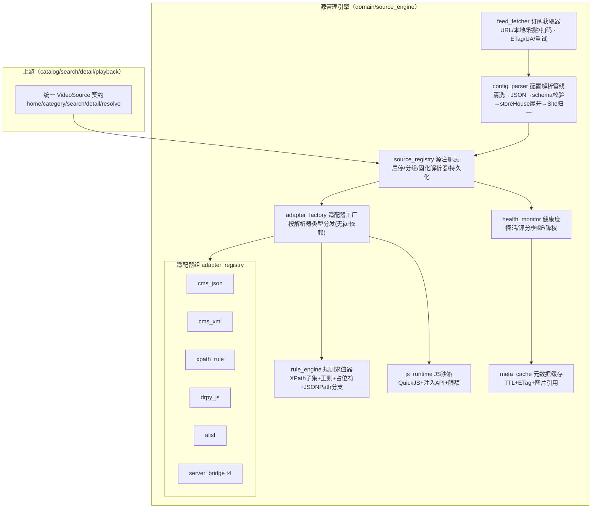
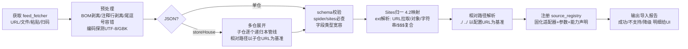

# 星映（StarScreen）· 源管理引擎开发报告

> 依据：[04-订阅源规范深度调研](./04-订阅源规范深度调研.md)（字段级规范 + 2026-09-26 实测）、[03-整体设计方案](./03-整体设计方案.md)（总体架构）
> 本文是**源管理引擎的开发设计书**：兼容策略、模块设计、解析管线、适配器规格、健康度引擎、测试与开发计划。

---

## 1. 目标与范围

**一句话**：把市面上主流的影视订阅源规范（TVBox 单仓/多仓、苹果CMS JSON/XML、csp 规则型爬虫、drpy JS 源、直播源、LibreTV 订阅）归一到星映统一的 `VideoSource` 契约之下，带健康度调度与沙箱安全。

**范围边界**：
- ✅ 做：配置解析与校验、站点归一注册、四类请求（首页/分类/搜索/详情）与播放地址解析、直播频道表、源健康度、元数据缓存、导入器（TVBox/LibreTV）。
- ❌ 不做：网页嗅探与第三方解析服务（`parses`）、jar/dex 动态加载（见第 7 节依据）、任何内容源的分发与推荐（合规基线）。

## 2. 兼容性总矩阵（核心决策）

| 层级 | 规范 | 策略 | 优先级 | 依据 |
|---|---|---|---|---|
| **原生适配** | 苹果CMS JSON（type=1） | 纯 HTTP+JSON 原生实现，含 AppYsV2 (`/api.php/v1.vod`)、`/from/`、`/at/` 路径式变体 | **P0** | 占比高、零插件、最快 |
| **原生适配** | 苹果CMS XML（type=0，含海洋/飞飞老式变体） | XML 流式解析 | **P0** | q9918 中占 18% |
| **原生适配** | TVBox 单仓配置 JSON / 多仓 storeHouse / txt 仓 | 解析导入管线 | **P0** | 生态事实标准 |
| **原生适配** | 直播 TXT / M3U（含 catchup 扩展属性）/ EPG 模板 | 解析器 + EPG 客户端 | **P1** | 实测格式明确 |
| **原生适配** | csp_AList（drives 挂载） | 原生 Alist API 适配器 | P2 | 网盘挂载差异化 |
| **沙箱执行** | drpy / drpy2 JS 源（`api=*.min.js`, `ext=源文件`） | QuickJS 沙箱 + 注入 API（pdfa/pdfh/pd/request/setResult...） | **P1** | 跨端主力，gao_js 298 源全走此路 |
| **规则转译** | csp_XPath / XPathMac / XPathMacFilter（ext 规则 JSON） | **原生"XPath 规则引擎"**：把 `Rule.java` 字段表实现为 Dart 规则求值器（XPath 子集 + 正则修正 + `{占位符}` + JSON 前缀分支），不跑 jar | **P1** | 功能等价、跨三端、免 jar |
| **规则转译** | csp_AppYsV2 | 归入 CMS JSON 变体分支 | P1 | 见 04 §4.2 |
| **转译（P2）** | csp_XYQHiker（海阔中文键规则） | 规则键值 → 内部 RuleSet 转译器 | P2 | 规则面广，先覆盖常用键 |
| **服务器桥** | hipy t4（type=4）、dr_py / drpy-node 服务器 | HTTP 客户端对接（协议需抓包逆向） | P2 | 社区服务器化趋势 |
| **不支持** | jar/dex 蜘蛛动态加载（非规则型 csp_*：Douban/Wogg/NiNi/lf_p2p/tvbus/thunder 等）、xwalk web 源、`parses/rules` 嗅探 | 明确不支持；UI 置灰并给出原因与替代建议 | — | 合规 + 跨端 + 安全（第 7 节） |

**支持率预估**（按 06 实测样本统计口径）：配置解析覆盖 ~100%；站点级可用率：纯 CMS 配置 100%、混合配置约 30–50%（csp 非规则型不可用）、js 型配置（gao_js 类）100%。UI 必须诚实呈现"该源需要原生蜘蛛，暂不可用"。

## 3. 引擎在整体架构中的位置

对 [03-整体设计方案](./03-整体设计方案.md) 第 3.1 节 domain 层的 `source_manager + source_adapters` 做深化拆分（新增 5 个子模块，其余模块接口不变）：



**关键设计原则**：
1. **解析器固化**：站点注册时就把"用哪个适配器 + 全部初始化参数"固化到站点记录上，聚合/合并配置永不覆盖（根治 04 §7.5 的 jar 覆盖陷阱）。
2. **契约不感知来源**：上游只见 `VideoSource`；适配器负责把异构数据清洗归一（标题/海报/备注/年份兜底）。
3. **能力声明**：注册时产出 `SourceCapabilities`（可搜索/可筛选/清晰度/需要嗅探→置灰），聚合搜索与 UI 据此分流。

## 4. 内部统一模型与映射

### 4.1 模型（drift 表 + 领域类）

```
Subscription(id, kind=tvbox|warehouse|libretv|live, url, etag, fetchedAt, raw)   // 订阅
SourceDef(id, subId, key, name, kind=cms_json|cms_xml|xpath_rule|drpy_js|alist|server_t4|live|unsupported,
          endpoint, extResolved, headers, timeoutMs, playerHint, enabled, sort, groupId,
          caps(searchable,quickSearch,filterable,qualities), unsupportedReason)
SiteSnapshot(key, name, poster, remarks)          // 失效仍可见（同 03 文档 work_snapshot）
HealthRecord(sourceId, ts, latencyMs, ok, failStage)
```

### 4.2 TVBox → 内部映射（解析阶段完成）

| TVBox 输入 | 解析动作 | 内部结果 |
|---|---|---|
| `sites[].type=1` + api | 剥离可能的 `?ac=list` 尾巴、识别 `/at/json`、`/v1.vod`（AppYsV2 分支） | `cms_json` |
| `type=0` + api（`at/xml`、`sapi.php`、`api/xml.php`、老式 `?ac=videolist`） | 同上识别变体 | `cms_xml` |
| `type=3` + `api=csp_XPath*` + ext | ext=URL→拉取；校验规则字段齐备度（缺关键字段→unsupported+原因） | `xpath_rule`（已解析 RuleSet 缓存） |
| `type=3` + `api=csp_AppYsV2` | split `###` 取 API | `cms_json`（variant=appys） |
| `type=3` + `api=csp_AList` | 解析 drives | `alist` |
| `type=3` + `api=csp_其他` | 无 jar 执行能力 | `unsupported`（reason=需原生蜘蛛 jar） |
| `type=3` + `api=*.js` + ext | 记录运行时 URL 与源 URL；两个都下载缓存 | `drpy_js` |
| `type=3` + `api=*.py` / dr_py 服务器地址 | — | `unsupported`（P2 升 server_bridge） |
| `type=4` | — | `unsupported`（P2） |
| `lives[]` | 解析频道表引用 + EPG 模板 | `live` 源 |
| `parses[]`/`rules[]`/`flags[]` | **不导入**（合规）；`flags` 中等于直连组名的无影响 | 丢弃并记录 |
| 站点 `jar`/全局 `spider` | **不做 jar 加载**；仅用于完整性校验与 unsupported 判定（csp_ 站点必然依赖 jar） | 记录引用 |

## 5. 订阅解析管线（config_parser）



**容错规则清单**（全部来自 04 §7 实测）：
1. 剥离 BOM、`//` 注释行、前置空白（实测 2 例）；JSON 修复失败则尝试宽松解析（尾逗号、单引号）。
2. HTML 落地页识别（`<!DOCTYPE`/`<html`）→ 标记"入口型接口"，尝试提取页面内 `.json` 链接再走一次管线；失败则提示用户手填直链。
3. `ext` 四形态：http URL（拉取，≤256KB 限额）、JSON 对象、JSON 字符串、`$$$` 复合串（按首个适配器声明的分段规则消费）。
4. `api` 带查询尾巴（`...?ac=list`）→ 基地址与默认参数分离。
5. 中文域名（IDN）转 punycode；HTTPS 证书失败可按源级开关降级警告。
6. 大配置（jk9.json 83KB/百站）流式处理 + 进度回调，TV 端可取消。
7. `pagecount=0`、`total` 缺失、`vod_time` 字符串、`vod_play_url` 缺失——全部按"缺省容错"处理（第 6 节适配器内）。

## 6. 适配器规格

### 6.1 cms_json / cms_xml（P0）

| 能力 | 实现 |
|---|---|
| home/category | `?ac=list`（+`t/pg`）；分类树取 `class[]`；筛选参数映射（year/isend 等按站点支持探测） |
| search | `?wd=...&pg=`；**total 缺失时以"无更多"策略收尾**（实测 suoni 现象） |
| detail | `?ac=detail&ids=`；字段级兜底：`vod_pic` 空用占位图、`vod_content` 去 HTML 标签、`vod_remarks` 直接做角标 |
| 播放解析 | `vod_play_from`(`$$$`/list 模式 `,`) × `vod_play_url`(`$$$` + `#` + `集名$地址`) → 多线路/选集树；线路名映射为人话（`bfzym3u8→暴风m3u8`，内置常见对照表+原样兜底）；网页地址（非 m3u8/mp4）标记"需解析"，**默认过滤并计数提示**（合规），用户可在设置中开启"显示需解析线路"但不可播 |
| 分页 | `pg` 递增；`pagecount=0` 或空 list 即停 |

XML 变体：`<dd flag>` 与老式 `from` 属性双兼容；`class/ty` 节点；CDATA 处理。

### 6.2 drpy_js（P1，QuickJS 沙箱）

- **运行时复用**：`drpy2.min.js` 一类运行时全站共享一个初始化实例，仅按 ext 切换源文件（gao_js 298 源共享运行时的实测结构决定此设计，启动快、内存省）。
- **注入 API 面**（最小完备，见 04 §4.3）：`request/post/fetch`（强制走统一请求池：并发计入源配额、UA/头受控）、`pdfa/pdfh/pd`（内置规则求值器复用 6.3）、`setResult/setResult2`、变量 `HOST/input/VOD/VODS/MY_CATE/MY_FL/MY_PAGE/TYPE`、`buildUrl/print/log`。**不注入**：文件系统、定时器、原生桥、任意全局网络代理。
- **函数映射**：`init/home/homeVod/category/detail/play/search/proxy` → Spider 接口（04 §4.3 表）；返回 JSON 串与 csp jar 同构，复用同一"Spider 返回归一器"。
- **`lazy/play_parse`**：返回 `{parse:0,url}` 直链即播；`parse:1`（需嗅探）→ 标记"该集需解析"，按合规策略过滤提示。
- **限额**：单调用 CPU 200ms × 段预算、内存 32MB、单源并发 1、总超时 = 站点 timeout（缺省 15s）；违规即熔断置灰。

### 6.3 xpath_rule（P1，原生规则引擎）

实现 `Rule.java` 字段表（04 §4.2）为 Dart 求值器：
- 选择器语言：HTML 用 xpath 子集（`//div[@class="x"]/a`，基于 `html` 包 + 自实现 xpath 求值；`||` 备选、`json:` 前缀走 JSONPath 分支）、`Text`/`html`/`@attr` 取值、`*R` 正则二次提取、`{cateId}{catePg}{vid}{wd}{playUrl}` 占位符、`playUrl/playUa/playReferer` 拼接。
- 与 drpy pdfh 的差异仅在语法层，两者共享底层"节点求值 + URL 补全 + 正则修正"管线，一套实现两种语法外壳。
- ext 校验：缺 `homeUrl` 或 `cateManual+cateNode` 双缺 → unsupported（原因展示）。

### 6.4 live（P1）

TXT（`#genre#` 分组、同名 `#` 多地址轮换）、M3U（`tvg-*`/`group-title`/`x-tvg-url`/`catchup-source` 保留字段）、EPG（`{name}{date}` 模板 → XMLTV 解析缓存按日）。JSON 直播格式 P2。

### 6.5 导入器（P0/P1）

- TVBox 单仓/多仓（P0，即主管线）
- LibreTV SourceList v2 / MoonTV `api_site`（P1，纯 JSON 映射为 cms_json 站点组）
- 星映自有导出格式（P1，与同步模块共用）

## 7. 为什么不做 jar 动态加载（决策记录）

1. **技术**：Spider 契约依赖 `android.content.Context` + `DexClassLoader`（04 §4.1 源码证据），Windows 端根本无法执行；三端一致是项目硬需求。
2. **安全**：dex 动态加载 = 任意原生代码执行，与"插件沙箱"红线冲突；生态中山寨捆绑 jar 已泛滥（调研一痛点 5）。
3. **合规**：jar 蜘蛛几乎全部用于抓取未授权站点。
4. **替代路径**（覆盖度递进）：规则型转译（XPath/AppYs/AList，P1）→ JS 源（drpy 生态已形成"jar→js"迁移趋势，P1）→ 服务器桥（drpyS/hipy t4，P2，让 jar 站点经用户自建服务器间接可用）→ 安卓端可选"外挂执行器"（P3 再评估，独立进程+权限声明）。

## 8. 健康度引擎（health_monitor）

参考 iptv-checker（HTTP 校验 + 可选 ffprobe 深检）与 fish2018/tvbox（可达性+JSON 有效性）思路 ✔ 调研，分层探活：

| 层级 | 动作 | 频率 | 判定 |
|---|---|---|---|
| L1 订阅可达 | GET 配置 URL（ETag 协商） | 启动 + 每 6h | 200 且可解析 |
| L2 站点探活 | `ac=list`（cms）或源首页调用（蜘蛛）抽 1 页 | 每源每 2h 轮转抽样 | 业务字段非空 |
| L3 播放抽检 | 取最新一条 play_url HEAD/2s 拉流 | 用户播放失败时被动 + 每日 1 源 | 2xx/可解析 m3u8 |
| 事件 | 播放失败/搜索超时实时反馈 | 即时 | 计入滑动窗口 |

**评分**：`score = 0.5×成功率(近20次) + 0.3×延迟分(1s 内满分) + 0.2×新鲜度(最近成功时间衰减)`；熔断：连续 5 次失败→禁用探活但仍可在手动刷新时重试。**调度联动**：聚合搜索按 score 排序并发（信号量 8）、详情页"其他源"按 score 排序、列表页置灰低分源。

## 9. 缓存与性能

| 对象 | 策略 |
|---|---|
| 订阅原文 | 内存+磁盘；`ETag/If-None-Match` 协商刷新；TTL 6h（手动刷新旁路） |
| ext 规则（XPath/douban 类） | 解析后缓存 RuleSet，ext URL 变更才失效 |
| drpy 运行时 | 按 URL 缓存编译产物，源文件按 key 缓存 |
| CMS 列表/详情 | SQLite TTL 缓存（列表 10min、详情 6h、搜索不缓存），TV 端内存 LRU 上限 64MB |
| 海报 | 磁盘 LRU（TV 默认 512MB，可调） |
| 网络池 | 每源独立 UA/超时（站点 header/timeout 字段落到位）、全局并发 32、单源并发 2 |

## 10. 安全与合规落点

1. `parses[]`、`rules[]` 不导入、不实现嗅探；`flags` 仅用于识别"需解析线路"并默认隐藏。
2. jar/spider 仅作引用记录与 unsupported 判定，永不下载执行（下载 md5 校验都省略，避免预加载恶意包）。
3. JS 沙箱限额 + 网络强制代理 + 域名黑名单（用户可编辑）。
4. 导入报告向用户明示：哪些站点因"需原生蜘蛛"不可用，原因透明（呼应 05 §2 UI 诚实原则）。
5. 测试源清单（06）仅存于文档供开发测试，不进入应用内任何推荐位。

## 11. 测试与验收

- **Fixture 回归**：从 06 的存活配置摘取脱敏样本固化为测试资产（单仓 5 种形态、多仓、txt/m3u 直播、CMS JSON/XML 响应、drpy 源 3 例、XPath ext 2 例、异常样本：注释前缀/HTML 落地页/pagecount=0/缺 total）。
- **契约测试**：每个适配器对 fixture 断言归一输出（分类数/字段兜底/线路树）。
- **实测冒烟**（CI 外手动，网络环境依赖代理）：对 06 标记"可用"的 8 接口跑通 home→category→search→detail→play_url 可达（本次调研已人工验证该链路：bfzy 全链路 200）。
- **验收标准（引擎可合入 v0.1）**：管线解析 06 全部存活配置无崩溃、CMS 双类型三端完成浏览→搜索→播放、不支持站点 100% 给出明确原因。

## 12. 开发里程碑

| 里程碑 | 内容 | 预估（人日） | 依赖 |
|---|---|---|---|
| M0 模型与管线 | 领域模型、drift 表、feed_fetcher、config_parser 全管线 + fixture 1 | 6 | 03 工程骨架 |
| M1 CMS 双适配器 | cms_json/xml + 播放地址解析 + 元数据缓存 + 契约测试 | 7 | M0 |
| M2 生态完整度 | 多仓/直播三格式/EPG + LibreTV 导入 + 导入报告 UI 契约 | 5 | M0 |
| M3 JS 沙箱 | QuickJS 接入、drpy 运行时复用、注入 API、限额熔断 | 10 | M1 |
| M4 规则引擎 | xpath_rule 求值器 + RuleSet 校验 + AppYsV2 变体 | 8 | M0 |
| M5 健康度与打磨 | health_monitor 三层探活 + 调度联动 + alist(P2 启动) | 6 | M1 |
| 合计 | | ≈42 人日 | |

（P2 项：XYQ 转译、t4 服务器桥、JSON 直播、AList 完整版另立迭代。）

## 13. 风险与开放问题

| 风险/问题 | 影响 | 对策 |
|---|---|---|
| drpy 注入 API 面在生态中存在方言（drpy1/2、lf_js、海阔系） | 部分 js 源跑不起来 | 按"运行时家族"适配（drpy2 优先），失败源给出明确错误码；fixture 持续扩充 |
| XPath 生态用 JXDocument 语法细节 | 个别规则求值偏差 | 建立 xpath 规则用例库，逐例对拍 |
| 入口型接口的跳转逻辑多样 | 少数"短域名"源需手填直链 | HTML 提取兜底 + 引导文案 |
| haiwaikan 等个别源本次 000 | 存活判断可能受代理出口影响 | 06 中标注"待直连复测"，探活引擎上线后自动复核 |
| type4 / t4 协议未证实 | 服务器桥延期 | P2 抓包逆向，不阻塞主线 |
| 聚合搜索源规模大（gao_js 298 站） | 并发风暴 | 信号量 + 能力过滤（searchable/quickSearch）+ 健康度排序，超时 8s 快速失败 |

## 14. 附：本次实测记录摘要（2026-09-26）

- 测活 34 个接口：8 个可用（4 个含完整结构解析）、约 70% 已失效——与用户"yxzhi 页面大多失效"的判断一致，已按用户建议另行收集 GitHub 活跃仓库（qist/tvbox、gaotianliuyun/gao）作为主力测试资产。
- CMS 字段实测：暴風/索尼两站 ac=list（8 字段精简结构）、ac=detail（83 字段）、搜索、XML 四类请求全部符合 04 §5 规范；播放 m3u8 直链 200。
- 直播：TXT（`#genre#`）、M3U（catchup/tvg 扩展）、EPG（XMLTV）三种格式实测通过。
- 全程经 iKuuuVPN 本地代理 `127.0.0.1:7890` 访问 GitHub raw / 境外接口，国内域名直连；明细见 [06-测试源清单](./06-测试源清单.md)。
