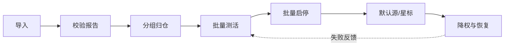

# 星映源管理交互改造方案

> 日期：2026-09-28 ｜ 依据：docs/17 StarRule、docs/05 源引擎、外部调研（FongMi / LibreTV / iptv-checker / 阅读 Legado / Kodi）
> 目标：把「列表开关」升级为 **导入 → 校验 → 分组 → 测活 → 启停 → 默认源 → 降权恢复** 的完整闭环。

---

## 1. 现状问题（已实测）

| 痛点 | 现状 | 影响 |
|---|---|---|
| 规则碎片 | type 0/1/3、jar、drpy、海阔、t4 各说各话 | 作者与用户都要猜 |
| 三端不齐 | jar 仅 Android/TV；桌面 `UnsupportedJarHost` | 同一订阅桌面少一大截 |
| 管理扁平 | 源页只有筛选 chip + 开关 + 删除 | 无分组、无健康度、无批量、无预览 |
| 诊断弱 | 测活只有 ok/失败原因一行 | 看不出是网络、规则还是站点挂了 |
| 无官方规则 | 用户只能抄 TVBox 生态 | 写源无标准、无校验器 |

---

## 2. 外部借鉴（可落地摘录）

### 2.1 值得抄

| 来源 | 借鉴点 | 落到星映 |
|---|---|---|
| **FongMi/TV** | 配置字典（字段+默认值）；多仓 `urls[]`；home 默认源；站点能力声明 | docs/17 字段表；多仓展开已有；`homeSiteKey` 已有；caps 扩展 |
| **LibreTV/MoonTV** | 批量测活 → **健康度阶梯停用**（30min→24h→长期）+一键恢复；跳过 jar 如实计数；导出分享 | health_monitor + 源页恢复按钮；import 报告按 kind 计数 |
| **iptv-checker** | 测活**任务化**（进度、并发、导入导出结果） | SourceChecker 已有并发+进度，升级为可取消任务 + 结果导出 |
| **阅读 Legado** | 四链路校验（搜/详/目/文）；`import?url=` 协议；源分组；失败可诊断 | 测活扩到 category/detail；星映深链；groupId 已有 |
| **Kodi/Jellyfin** | manifest：id/version/checksum/分类 | StarRule `meta`；规则包 `pack` |

### 2.2 不抄

1. jar/dex 动态加载、xwalk、网页嗅探（跨端死路 + 合规红线，docs/05 §7 维持）。
2. TVBox `parses/rules` 第三方解析生态。
3. 全局 `spider` 覆盖式合并（坚持「解析器固化」）。
4. 把 drpy/海阔/hipy 硬揉成单一 DSL——用 **StarRule 为目标格式 + 转换器**，原格式保留兼容。
5. 纯列表开关 UI、LibreTV 服务端代理（三端需本地执行）。

---

## 3. 目标信息架构

```
源管理
├── 顶栏：添加订阅 / 添加 StarRule / 测活 / 批量操作 / 搜索框
├── 筛选：全部 | 启用 | 失效 | 停用 | 不支持 | ★收藏 | 按类型 | 按分组
├── 左栏（桌面）/ 抽屉（手机）：分组树
│     ├── 订阅：qist·0827
│     ├── 订阅：gao·0825
│     ├── 规则包：我的源
│     └── 系统：直播
└── 列表行（信息密度升级）
      [开关] [名称] [类型徽章] [健康度点] [延迟ms] [分组] [★] [⋮]
      └─ 行内：unsupported 原因 / 测活失败原因（可点开详情）
```

TV 端：同一数据源，卡片 + 遥控器焦点；批量改为「多选模式」。

---

## 4. 黄金路径（七步）



| 步 | 动作 | 交互要点 | 借鉴 |
|---|---|---|---|
| 1 导入 | URL / 文件 / 粘贴 / 二维码 / `starrule://import?url=` | 容错清洗；ETag 304；多仓展开 8 层上限 | FongMi Depot、阅读 import |
| 2 校验 | 立即出 **导入报告** | 成功 / 降级 / 不支持 / 有 issue；可展开每条原因 | 阅读诊断、LibreTV 如实计数 |
| 3 分组 | 自动按订阅名/规则包名 | 可改名、可拖到自定义分组 | Legado 源分组 |
| 4 测活 | 一键 / 按分组 / 按筛选结果 | 进度条、可取消、结果可导出 JSON | iptv-checker 任务化 |
| 5 启停 | 勾选批量；过滤器联动 | 不支持源默认禁用并保留原因 | 现状保留 |
| 6 默认源 | 星标 = 收藏；首页源下拉 | FongMi home 站点 | 已有 homeSiteKey |
| 7 降权 | 失败自动降权；连续 5 次熔断 | **阶梯**：2 次失败→标记失效；5 次→停用探活 30min；再失败→24h；一键恢复 | LibreTV 阶梯 |

---

## 5. 健康度与阶梯熔断

现有 `SourceHealth`（成功率/延迟/新鲜度）保留，增加：

| 字段 | 类型 | 说明 |
|---|---|---|
| `failStreak` | int | 连续失败次数 |
| `coolUntil` | DateTime? | 熔断至（30min / 24h 阶梯） |
| `lastFailReason` | string? | 最近失败原因（展示） |
| `starred` | bool | 用户星标 |

**调度联动**（docs/05 §8 已有 score）：

- 聚合搜索：score 降序；`coolUntil` 未到的源跳过。
- 详情「其他源」：score 排序。
- 源列表：健康度点绿/黄/红/灰；失效筛选 chip 计数实时。

**一键恢复**：清空 `failStreak` / `coolUntil`，立即重新探活。

---

## 6. 测活任务升级（SourceChecker）

| 现状 | 升级 |
|---|---|
| home → 失败再 search | **四链路可选**：L1 订阅可达 / L2 首页 / L3 搜索 / L4 详情+播放抽检 |
| 不可取消 | `Cancelable` 任务，UI 显示 `done/total` |
| 结果只在内存 | 写入 HealthRecord + 可导出 |
| 仅全部源 | 作用域：全部 / 当前筛选 / 当前分组 / 勾选 |

失败原因分级文案：

| 代码 | 文案 |
|---|---|
| `timeout` | 检测超时（8s） |
| `dns` | 域名解析失败 |
| `http_4xx/5xx` | HTTP 403/500… |
| `empty` | 首页与搜索均无结果 |
| `parse` | 响应无法解析（规则可能失效） |
| `needs_jar` | 该源需 jar，当前端不支持 |
| `needs_js` | 该源含脚本，引擎未就绪 |

---

## 7. StarRule 在管理端的呈现

| 对象 | UI |
|---|---|
| 导入 `.star.json` | 识别 `starrule:1`，类型徽章「StarRule」 |
| 校验失败 | 按 docs/17 §10 级别展示（致命拒绝 / 警告可导入） |
| `convertedFrom` | 行 tooltip「由 XPath/drpy 转译」 |
| 规则包 | 一个订阅条目，展开显示 sites[] |
| 三端一致 | 徽章「三端可用」；jar 源徽章「仅安卓」 |

---

## 8. 分阶段落地

| 阶段 | 内容 | 优先级 |
|---|---|---|
| **P0** | StarRule 模型+解析+StarRuleSource + 导入识别 + docs/17 | 本迭代 |
| **P0** | 源页信息架构：分组树 + 类型/健康度徽章 + 批量勾选启停 | 本迭代 |
| **P1** | ✅ 四链路测活 + 阶梯熔断 + 一键恢复 | 已落地 0.1.0-dev.43/44 |
| **P1** | ✅ XPath→StarRule（导入自动）/ drpy→StarRule | 已落地 |
| **P2** | ✅ `starrule://import` 深链；规则市场待做 | 深链已落地 |
| **P2** | 源预览（行内试搜一部片） | 后续 |

---

## 9. 验收标准（管理端）

1. 导入同一 TVBox 配置后，**支持数**与**不支持原因**在三端文案一致（能力差异仅 jar）。
2. 导入 StarRule 规则包，手机/桌面/TV 均可浏览、搜索、详情、播放。
3. 源页可按分组/类型/健康度筛选；批量测活可取消；失败原因可读。
4. 连续失败源自动降权/熔断，一键恢复后重新参与聚合。
5. 空状态与错误绝不静默：每个「灰掉」的源都能看到原因。

---

## 10. 与 StarRule 规范的边界

- 本方案管 **怎么管源**；docs/17 管 **怎么写源**。
- 管理端不发明新规则字段；一切以 docs/17 为准。
- 转换器产出带 `convertedFrom`，便于用户改写为纯 StarRule 后去掉脚本。
